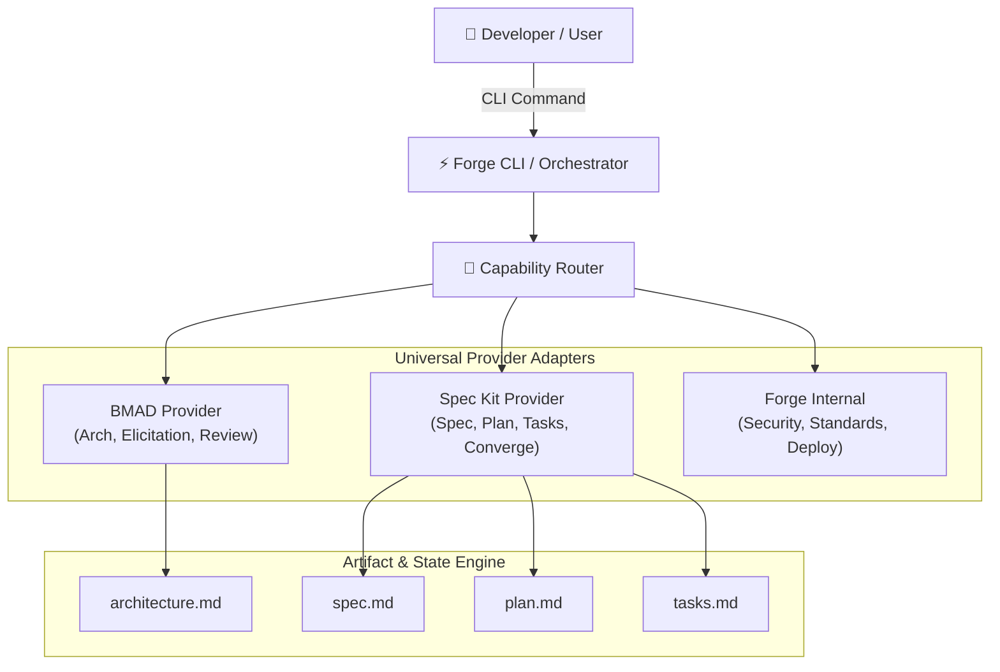

# Technical Architecture Document

**Project:** forge-sdlc  
**Authoring Engine:** BMAD Architecture Engine (v2.4.0)  
**Status:** Approved  
**Last Updated:** 2026-08-30T07:59:32.995Z  

---

## 1. Executive Summary & Architectural Goals
This document specifies the technical architecture for **forge-sdlc**. The design emphasizes high modularity, deterministic state boundaries, type safety, low latency, and zero circular dependencies.

### Core Architectural Drivers
- **Scalability & Concurrency:** Isolated stateless compute units with asynchronous execution pipelines.
- **Maintainability:** Domain-Driven Design (DDD) with clean hexagonal / ports-and-adapters architecture.
- **Extensibility:** Universal provider abstraction layer allowing hot-swappable plugins without core refactors.

---

## 2. System Context & C4 Architecture Diagrams



---

## 3. Component Boundaries & Layering

```
┌──────────────────────────────────────────────────────────┐
│                      Presentation Layer                  │
│       CLI Commands, Interactive Prompts, TUI Tables      │
└────────────────────────────┬─────────────────────────────┘
                             │
┌────────────────────────────▼─────────────────────────────┐
│                    Orchestration Layer                   │
│   Capability Router • Scoring Engine • Workflow Runner   │
└────────────────────────────┬─────────────────────────────┘
                             │
┌────────────────────────────▼─────────────────────────────┐
│                      Adapters Layer                      │
│        BMAD Adapter  •  Spec Kit Adapter  •  Internal     │
└────────────────────────────┬─────────────────────────────┘
                             │
┌────────────────────────────▼─────────────────────────────┐
│                  Infrastructure & Storage                │
│    File System Artifacts (.forge/) • Config & Templates  │
└──────────────────────────────────────────────────────────┘
```

---

## 4. Key Architectural Decisions (ADR Summary)

| ADR ID | Decision | Justification | Alternatives Considered |
| :--- | :--- | :--- | :--- |
| **ADR-001** | Capability-First Abstraction | Decouples user intent from underlying tool vendors. | Vendor-locked skill scripts |
| **ADR-002** | Multi-Factor Dynamic Scoring | Enables context-aware provider routing with zero hardcoding. | Static lookup tables |
| **ADR-003** | Artifact Pipeline Contract | Standardized Markdown documents serve as universal inter-agent memory. | Proprietary binary databases |

---

## 5. Non-Functional Invariants & Cross-Cutting Concerns
- **Idempotency:** Re-running architecture generation produces deterministic, consistent schemas.
- **Observability:** Structured logging and timing metrics across all provider execution steps.
- **Fail-Safe Fallbacks:** If a specialized provider is missing, automatic graceful degradation to Forge Internal.
