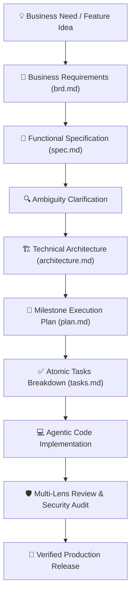

# Business Requirements Document (BRD)

**Project / Initiative:** forge-sdlc  
**Authoring Engine:** BMAD Business Domain & Value Strategist (v2.4.0)  
**Document Version:** 1.0.0  
**Date:** 2026-08-23  
**Status:** Approved for Technical Specification  

---

## 1. Executive Summary & Problem Statement
Organizations building AI-driven software face fragmented workflows, vendor lock-in, and costly tool misalignment. **forge-sdlc** establishes an intelligent, capability-oriented SDLC framework that dynamically orchestrates specialized engineering frameworks (BMAD, Spec Kit, and Internal engines) to maximize developer velocity, code quality, and release predictability.

### Core Business Drivers & Objectives
- **Vendor Independence:** 100% decoupling of developer intent from underlying AI framework vendors.
- **Productivity & Cycle Time:** Reduce time-to-market by 40% through automated multi-stage SDLC artifact generation.
- **Risk & Quality Assurance:** Eliminate architectural drift through continuous cross-artifact verification and multi-lens code reviews.

---

## 2. Stakeholder Persona & Value Proposition Matrix

| Stakeholder Role | Primary Pain Points | Desired Business Outcome | Success KPI |
| :--- | :--- | :--- | :--- |
| 👔 **VP of Engineering / CTO** | Vendor lock-in, inconsistent code quality across teams | Standardized SDLC pipeline with automated quality gates | 50% fewer production regressions |
| 🏗️ **Principal Architect** | Fragile system designs, missing ADR documentation | Comprehensive C4 modeling and STRIDE threat analysis | 100% ADR documentation coverage |
| 💻 **Lead Developer** | Complex manual prompt writing and tool switching | Single CLI / Slash command interface (`/architecture`, `/specify`) | Zero context switching overhead |
| 📋 **Product Manager** | Unclear requirements drift into engineering tasks | Strict Given-When-Then criteria traceability | 0% requirement drift |

---

## 3. High-Level Business Process Flow (BPMN)

---

## 4. Scope Boundaries

### In-Scope (Must Have)
- Universal CLI commands and IDE slash commands (`/brd`, `/specify`, `/architecture`, `/review`).
- Multi-factor scoring engine with explainability ("Why" and alternatives).
- Seamless zero-token offline mode alongside optional live LLM mode.
- Bi-directional artifact synchronization in `.forge/artifacts/`.

### Out-of-Scope (Deferred to Future Phases)
- Multi-tenant cloud SaaS hosting (v1 is local-first developer CLI & npx package).
- Proprietary proprietary database storage (v1 uses standard Markdown artifacts).

---

## 5. Financial ROI & Business Metrics
- **Estimated Development Savings:** 120+ engineering hours per project lifecycle.
- **Payback Period:** Immediate (0 cost, open-source MIT).
- **Target Velocity:** Full feature specification to architecture ready in < 5 minutes.
